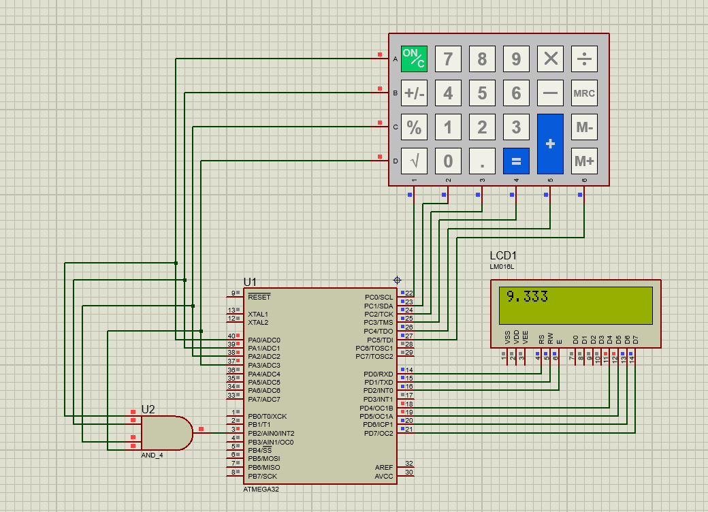

# ATmega32 Calculator

  

  **A scientific calculator implemented using ATmega32 microcontroller**

## Features
- Addition, Subtraction, Multiplication, Division
- Percent and Square Root
- EEPROM Memory
- Floating Point operations
- 4x6 Keypad + 16x2 LCD Display

## Tools & Software
- **CodeVisionAVR**
- **Proteus 8**

## Project Structure
- `Source/` → C source code
- `HEX/` → Compiled HEX file
- `Proteus/` → Circuit simulation file
- `Images/` → Project screenshots

---

## Simulation

